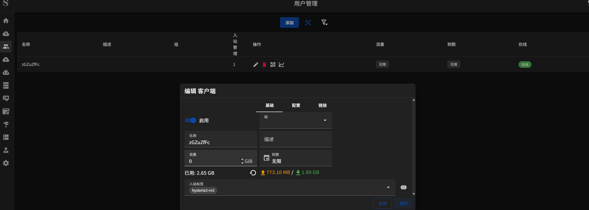

<h3 align="center">s-ui Traffic Exporter</h3>
<div align="center">

[](https://github.com/itning/s-ui-traffic-exporter/stargazers)
[](https://github.com/itning/s-ui-traffic-exporter/network/members)
[](https://github.com/itning/s-ui-traffic-exporter/watchers)
[](https://github.com/itning?tab=followers)


</div>

<div align="center">

[](https://github.com/itning/s-ui-traffic-exporter/issues)
[](https://github.com/itning/s-ui-traffic-exporter/blob/master/LICENSE)
[](https://github.com/itning/s-ui-traffic-exporter/commits)
[](https://github.com/itning/s-ui-traffic-exporter)
[](https://github.com/itning/hit-count)

</div>

---

# 介绍

功能：将s-ui中的流量信息上报给Prometheus

实现效果：


在s-ui中：



# 使用

```shell
./s-ui-traffic-exporter-linux-amd64 --web.listen-address=":9100" 
```

```text
# HELP name_traffic_download_bytes_total Total bytes downloaded by each name.
# TYPE name_traffic_download_bytes_total counter
name_traffic_download_bytes_total{enable="true",name="zGZuZfFc"} 1.819867959e+09
# HELP name_traffic_upload_bytes_total Total bytes uploaded by each name.
# TYPE name_traffic_upload_bytes_total counter
name_traffic_upload_bytes_total{enable="true",name="zGZuZfFc"} 7.16911518e+08
```

默认使用s-ui sqlite数据库位置为：`/usr/local/s-ui/db/s-ui.db`

如果不在默认位置可以通过参数修改，例如`--db-path=/home/xui.db`

支持TLS：`--web.config.file=web-config.yml`

具体配置：[exporter-toolkit web-configuration](https://github.com/prometheus/exporter-toolkit/blob/master/docs/web-configuration.md)

# 感谢

